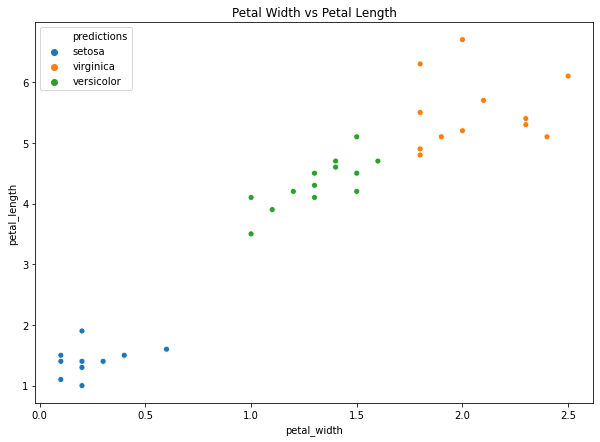

# About this repository

 This repository is a <b>Flask App</b> that has a machine learning model merged with it and deployed on heroku.  This predicts famous iris species among <i>Versicolor, Setosa and Virginica</i>
  

<h5>Here is picture of thosed species</h5>  

# ML model used

In this repository I have used <b>Linear Support Vector Classsification</b> model pre-built in sklearn for predicting classes.
LinearSVC works well for datasets having less data and less atrributes to train the model. Dataset used has only 150 data samples overall so
LinearSVC performed well with accuracy of 93% and predicted only 3 test data wrong.

 

# Predicted classes visualization
<h3>Scatter plot between attributes and categorized using color based on predictions</h3>

More visualization can be found in jupyter notebook in this repository itself named: <b>Flowers Identification using svm.ipynb</b> 

# Libraries used
<ul>
<li>Numpy</li>
<li>Pandas</li>
<li>Seaborn</li>
<li>Matplotlib</li>
<li>Sklearn</li>
</ul>
